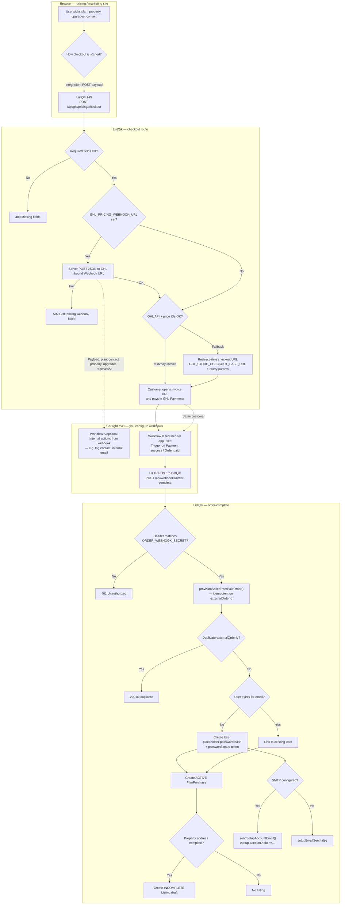
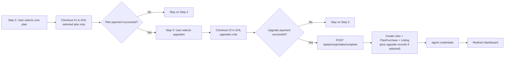

# Pricing plan purchase → GHL → user provisioning

This document describes how **ListQik** connects **pricing / checkout**, **GoHighLevel (GHL)**, and **user + listing creation** in this codebase.

There are **two paths**:

1. **Path A — Pay in GHL** — `POST /api/ghl/pricing/checkout` (optional GHL notify webhook, then GHL payment), then **your GHL workflow** calls `POST /api/webhooks/order-complete` after payment.
2. **Path B — In-app pricing wizard with staged GHL payments** — Step 2 runs a **plan-only GHL checkout**, then Step 3 runs an **upgrades checkout** before intake is completed.

Implementation references:

- Checkout + optional GHL webhook: `src/app/api/ghl/pricing/checkout/route.ts`
- Paid-order webhook: `src/app/api/webhooks/order-complete/route.ts`
- Provisioning logic: `src/lib/seller-order-provision.ts`
- In-app intake: `src/app/api/pricing/intake/complete/route.ts`
- Wizard UI: `src/components/pricing/pricing-console.tsx`

## Rendered flowcharts (shapes — not Mermaid source)

| File | Description |
|------|-------------|
| [diagrams/pricing-ghl-path-a.pdf](diagrams/pricing-ghl-path-a.pdf) | Path A as PDF (boxes, diamonds, arrows). |
| [diagrams/pricing-ghl-path-b.pdf](diagrams/pricing-ghl-path-b.pdf) | Path B as PDF. |
| [diagrams/pricing-ghl-path-a.svg](diagrams/pricing-ghl-path-a.svg) | Path A as SVG (open in browser or editor). |
| [diagrams/pricing-ghl-path-b.svg](diagrams/pricing-ghl-path-b.svg) | Path B as SVG. |
| [diagrams/pricing-ghl-flows-print.html](diagrams/pricing-ghl-flows-print.html) | Both charts on one page — **Print → Save as PDF** for a single combined PDF. |

Source definitions (editable): `diagrams/pricing-ghl-path-a.mmd`, `diagrams/pricing-ghl-path-b.mmd`. Regenerate PDF/SVG after edits:

```bash
npx -y @mermaid-js/mermaid-cli@11 -q -i docs/diagrams/pricing-ghl-path-a.mmd -o docs/diagrams/pricing-ghl-path-a.pdf -f -w 1600 -H 2400 -t neutral
npx -y @mermaid-js/mermaid-cli@11 -q -i docs/diagrams/pricing-ghl-path-b.mmd -o docs/diagrams/pricing-ghl-path-b.pdf -f -w 1200 -H 400 -t neutral
npx -y @mermaid-js/mermaid-cli@11 -q -i docs/diagrams/pricing-ghl-path-a.mmd -o docs/diagrams/pricing-ghl-path-a.svg -w 1600 -H 2400 -t neutral -b transparent
npx -y @mermaid-js/mermaid-cli@11 -q -i docs/diagrams/pricing-ghl-path-b.mmd -o docs/diagrams/pricing-ghl-path-b.svg -w 1200 -H 400 -t neutral -b transparent
```

---

## Path A — Paid in GHL → webhook creates user



### Environment and contracts

| Variable / endpoint | Role |
|---------------------|------|
| `GHL_PRICING_WEBHOOK_URL` | ListQik **forwards** the checkout JSON to your GHL inbound webhook (optional; if set, webhook failure returns **502**). |
| `GHL_PRIVATE_INTEGRATION_TOKEN`, `GHL_LOCATION_ID` | Used to build **Text2Pay** invoice or resolve price IDs. |
| `GHL_PLAN_PRICE_IDS` / `GHL_PLAN_PRODUCT_IDS`, `GHL_UPGRADE_PRICE_IDS` | Map plans and upgrades to GHL price/product IDs. |
| `GHL_STORE_CHECKOUT_BASE_URL` | Fallback **redirect** checkout URL when invoice path is not used or fails. |
| `POST /api/webhooks/order-complete` | Expects `x-webhook-secret` or `Authorization: Bearer` matching `ORDER_WEBHOOK_SECRET`. Body: `OrderWebhookPayload` — include `externalOrderId` for idempotency. |
| SMTP env vars | Used by `sendSetupAccountEmail` in `src/lib/transactional-email.ts` — **ListQik** sends the password-setup email, not GHL (unless you duplicate email in GHL). |

---

## Path B — Pricing wizard with Step 2 + Step 3 GHL checkouts



This path performs two explicit GHL checkout events in the wizard:

- Step 2 checkout: the selected base plan.
- Step 3 checkout: selected upgrades (if any).

The wizard should only proceed to `POST /api/pricing/intake/complete` after the required payment(s) succeed.

---

## Exporting to PDF (summary)

- Use the prebuilt **`diagrams/pricing-ghl-path-a.pdf`** and **`pricing-ghl-path-b.pdf`**, or open **`diagrams/pricing-ghl-flows-print.html`** in a browser and choose **Print → Save as PDF** for one file with both flowcharts.

---

## Related: lead capture (not pricing)

`POST /api/ghl/lead` forwards to `GHL_LEAD_WEBHOOK_URL` — separate from the pricing checkout flow. See `src/app/api/ghl/lead/route.ts` and `README.md`.
